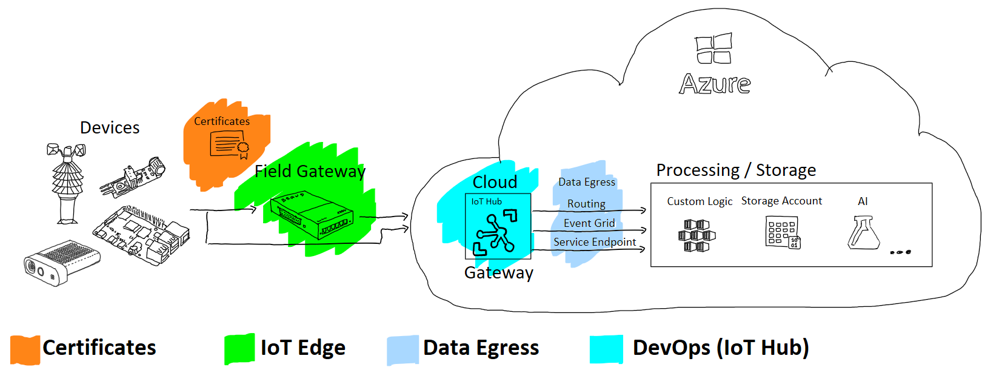

# IoT Production Training Pack

The IoT Production Training Pack contains a collection of examples and best practices to address common IoT use cases and challenges. The content is a combination of experiences from Microsoft teams and learnings from customer engagements.

The IoT Production Training Pack can help you to implement best practices, use the Azure IoT service which fits best to your scenario and to avoid common pitfalls when implementing IoT projects using Microsoft Azure IoT.

The IoT Production Training Pack is modular so you can jump to any section of interest or start at the beginning. The slides, demos and source code for each module are shared with a creative commons (with attribution) license to help your organization build effective IoT solutions With Azure IoT.

## Overview

A typical IoT scenario consists of:

* IoT devices
* Field gateways
* A cloud gateway (edge based processing and storing capabilities)
* Cloud based processing and storage capabilities

## Modules

The Training Pack focuses on the following independent modules:

* [Certificates](modules/Certificates101/index.md): A proper understanding of certificates and their use is critical for
a production IoT deployment.

* [Data Egress](modules/DataEgress/index.md): This module covers multiple ways to egress data from IoT Hub
  * [IoT Hub Routes](modules/DataEgress/routing.md) provides and overview and gives best practices how IoT Hub's data routing functionality can be used to ***push*** data to other Azure PaaS services like Service Bus, Event Hubs or Azure Storage. It highlights how messages ingested to IoT Hub can be enriched and how messages can be filtered.
  * [Event Grid integration](modules/DataEgress/eventgrid.md): provides and overview how the IoT Hub Event Grid integration can be used to ***push*** data to other Azure PaaS services.
  * Service Endpoints: Will be provided soon.

* [DevOps for Azure IoT](modules/DevOps/index.md): Azure IoT and DevOps can work together to build scalable, reliable, and secure IoT solutions using CI/CD (Continuous Integration and Continuous Delivery) and IaC (Infrastructure as Code).

* [IoT Edge](modules/IoTEdge/index.md): This module covers the capabilities Azure IoT Edge can bring into your IoT solutions including edge computing, offline support, cost optimization, etc.

## Contributing

This project welcomes contributions and suggestions.  Most contributions require you to agree to a
Contributor License Agreement (CLA) declaring that you have the right to, and actually do, grant us
the rights to use your contribution. For details, visit [the CLA site](https://cla.opensource.microsoft.com).

When you submit a pull request, a CLA bot will automatically determine whether you need to provide
a CLA and decorate the PR appropriately (e.g., status check, comment). Simply follow the instructions
provided by the bot. You will only need to do this once across all repos using our CLA.

This project has adopted the [Microsoft Open Source Code of Conduct](https://opensource.microsoft.com/codeofconduct/).
For more information see the [Code of Conduct FAQ](https://opensource.microsoft.com/codeofconduct/faq/) or
contact [opencode@microsoft.com](mailto:opencode@microsoft.com) with any additional questions or comments.

## Trademarks

This project may contain trademarks or logos for projects, products, or services. Authorized use of Microsoft
trademarks or logos is subject to and must follow
[Microsoft's Trademark & Brand Guidelines](https://www.microsoft.com/legal/intellectualproperty/trademarks/usage/general).
Use of Microsoft trademarks or logos in modified versions of this project must not cause confusion or imply Microsoft sponsorship.
Any use of third-party trademarks or logos are subject to those third-party's policies.
