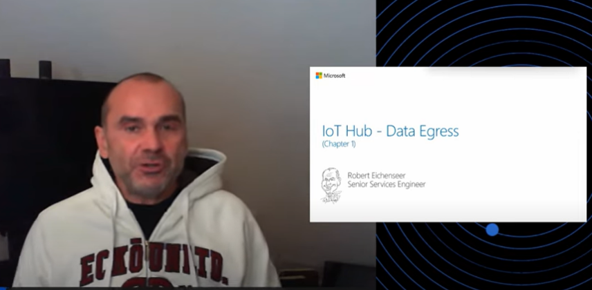
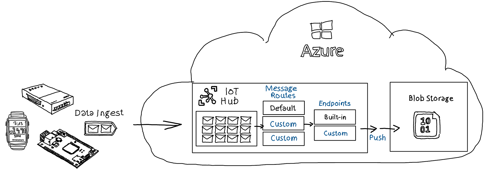

# IoT Production Training Pack - DataEgress Routing

## Overview

Azure IoT Hub is a fully managed service that helps enable reliable and secure bi-directional communications between millions of devices and a solution back end.

Custom functionality which processes data or messages sent from devices to IoT Hub can retrieve information using two different patterns:

* Message Routing: IoT Hub actively ***pushes*** messages
* Service Endpoint: IoT Hub provides messages to be ***pulled***

  

### TL;DR

This repository showcases:

* sending data to IoT Hub
* enriching the data with information from the device's Azure IoT Hub Device Twin
* routing all incoming messages to a custom endpoint (Azure Blob Storage)
* routing selected incoming messages based on a query to a custom endpoint (Azure Bob Storage)

### Watch the video / Get the presentation

[Get the presentation](media/IoTTrainingKit-DataEgress-Push.pdf)

## IoT Hub Functionality

### Message Routing (Push of messages)

IoT Hub allows the definition of message routes and and message endpoints. IoT Hub Message Routing enables users to route (push) device-to-cloud messages to service-facing endpoints.

### Endpoints

The service-facing endpoint defines to which Azure service the message will be forwarded to. Currently messages can be routed to the following Azure services:

* Storage containers (Azure Blob Storage, Azure Data Lake Gen 2)
* Event Hubs
* Service Bus Queues
* Service Bus Topics
* Cosmos DB (preview)

### Message Routes

A message route allows to define queries that are applied to each individual message processed by IoT Hub. These queries determine to which endpoint the message is routed. A route can be defined without a query and therefore all messages processed by IoT Hub will be pushed to a message endpoint defined in the route.

  

An IoT hub has a default built-in endpoint where messages arrive when:

* there's no custom route defined
* a message doesn't match any query

### Message enrichment

Message enrichments is the ability of an IoT hub to stamp messages with additional information before the messages are sent to the designated endpoint.

## Example Code

Please see the [DataEgress-101-Routing](https://github.com/Azure/IoTTrainingPack/tree/main/modules/DataEgress-101-Routing) folder for code samples.

